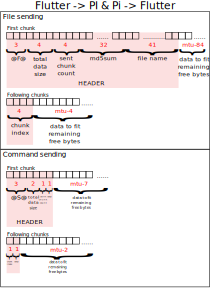

# flutter_ble_data_handler

Flutter package which handles data packages to use with bluetooth low energy.
It splitts data into chunks based on the MTU size. 

## Note

- This package is still in work, so please be aware of breaking changes. 
- An example for receiver/sender side written in node.js is comming soon.

## Telegram

|                                  | File data mode (File sending)                                      | Message data mode (Command sending)                     |
|----------------------------------|--------------------------------------------------------------------|---------------------------------------------------------|
| Description                      | This mode is used for transfering binary files over ble.           | This mode is used for transfering string data over ble. |
| Indicator                        | \$F\$                                                              | \$S\$                                                   |
| transfer mode                    | binary                                                             | binary and retransformation                             |
| Header size - initial chunk      | 84 bytes                                                           | 7 bytes                                                 |
| Header size - following chunk(s) | 4 bytes                                                            | 2 bytes                                                 |
| Header data - initial chunk      | Indicator + total data size + sent chunk count + md5sum + filename | Indicator + total data size + sent chunk count + CRC8   |
| Header data - following chunk(s) | chunk index                                                        | chunk index + CRC8                                      |
| Usage data size                  | MTU - Header size = usage data                                     | MTU - Header size = usage data                          |
| Usage example                    | JSON Files, images, update files, ...                              | String commandos for sensors and actuators              |

**Support**:
- chunked data with "theoreticaly unlimited data size"
- Transfer of "Message" data and "Binary/File" data
- Cheksum calculation for messages and for files

**Communications way**:
* File data mode
  - Flutter --> powerIO-Box (stable)
  - Raspberry Pi --> Flutter (experimental)
  
* Message data mode
  - Flutter --> powerIO-Box (stable)
  - Raspberry Pi --> Flutter (stable)
  
**limitations**:
- filename size is limited to 41 bytes (enough for UUID v4)
- transfer rate (155 byte each package)

### visual telegram 

